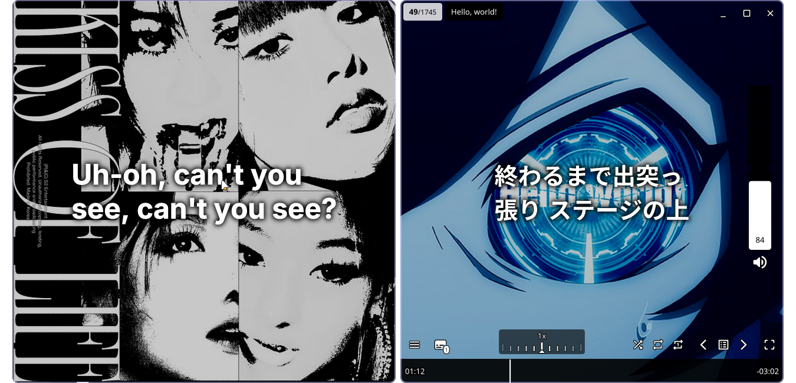

# ✨🎵 MPV Music

it's a dotfile that turns mpv into a beautiful, comfy music player, ngl prolly the best on linux 💀

### 🛠️ What does it do?

 - 🎧 Converts mpv into a fully-featured music player.

    - 🔄 Adds autoload support – when you double-click a song, it loads the entire folder as a playlist automatically. No more lonely tracks :(

    - 🎤 Integrates with [mpv-lrc](https://github.com/guidocella/mpv-lrc) to auto-fetch synced lyrics
    - 💪 Further enhances auto fetched lyrics with a custom script that autoloads lyrics with a overlay that dims the background slightly and vertically aligns the font that the user configures in the middle.

    - 📝 Custom rewrite of [Parranoh's](https://github.com/Parranoh/mpv-notify-send/blob/master/notify-send.lua) script to support sending notifications with embedded cover art from a file. (It doesn't replace the notification and creates a new one when you change songs for now)

    - 📦 Designed to be run inside Distrobox, but you can just adapt it to work outside im not gonna make it work outside sorry im lazy

    - ⚙️ Makes use of the [default](https://github.com/mpv-player/mpv/blob/master/etc/mpv.conf) mpv.conf with few tweaks

    - 💻 Comes with a .desktop launcher that hooks umpv and should work out of the box

## 🔗 Automated install

simply run
```sh
/bin/bash -c "$(curl -fsSL https://raw.githubusercontent.com/vndreiii/mpv-music/main/install.sh)"
```


## 📁 Manual setup Instructions

### 📦 0. Setup your distrobox and mpv

Use preferably an Arch distrobox with the following packages:
```bash
mpv
mpv-autosub-git
mpv-autosubsync-git
mpv-handler-git
mpv-mpris
mpv-thumbfast-git
adwaita-fonts
```

Separate your home to not clutter your real home, in case you have another mpv installed like me.

I made mine like this: `distrobox create --name MPV --image archlinux:latest --home $HOME/Distroboxes/mpv`

After installing the mentioned packages export mpv into your host distro with `distrobox-export --app mpv`

Now we're going to modify the desktop file to suit our needs (to use umpv and to not load flags as a playlist.. which happened to me)

I renamed the exported .desktop file to MPV-mpv.desktop (because I have another MPV installed on my host distro) and inside it looks like this

```ini
[Desktop Entry]
Categories=AudioVideo;Audio;Video;Player;TV;
Comment=Play music with mpv
Exec=/usr/bin/distrobox-enter -n MPV -- umpv %U
GenericName=Music Player
Icon=/path/to/icon.svg (use any icon here)
Keywords=mpv;media;player;video;audio;tv;
MimeType=application/ogg;application/x-ogg;application/mxf;application/sdp;application/smil;application/x-smil;application/streamingmedia;application/x-streamingmedia;application/vnd.rn-realmedia;application/vnd.rn-realmedia-vbr;audio/aac;audio/x-aac;audio/vnd.dolby.heaac.1;audio/vnd.dolby.heaac.2;audio/aiff;audio/x-aiff;audio/m4a;audio/x-m4a;application/x-extension-m4a;audio/mp1;audio/x-mp1;audio/mp2;audio/x-mp2;audio/mp3;audio/x-mp3;audio/mpeg;audio/mpeg2;audio/mpeg3;audio/mpegurl;audio/x-mpegurl;audio/mpg;audio/x-mpg;audio/rn-mpeg;audio/musepack;audio/x-musepack;audio/ogg;audio/scpls;audio/x-scpls;audio/vnd.rn-realaudio;audio/wav;audio/x-pn-wav;audio/x-pn-windows-pcm;audio/x-realaudio;audio/x-pn-realaudio;audio/x-ms-wma;audio/x-pls;audio/x-wav;video/mpeg;video/x-mpeg2;video/x-mpeg3;video/mp4v-es;video/x-m4v;video/mp4;application/x-extension-mp4;video/divx;video/vnd.divx;video/msvideo;video/x-msvideo;video/ogg;video/quicktime;video/vnd.rn-realvideo;video/x-ms-afs;video/x-ms-asf;audio/x-ms-asf;application/vnd.ms-asf;video/x-ms-wmv;video/x-ms-wmx;video/x-ms-wvxvideo;video/x-avi;video/avi;video/x-flic;video/fli;video/x-flc;video/flv;video/x-flv;video/x-theora;video/x-theora+ogg;video/x-matroska;video/mkv;audio/x-matroska;application/x-matroska;video/webm;audio/webm;audio/vorbis;audio/x-vorbis;audio/x-vorbis+ogg;video/x-ogm;video/x-ogm+ogg;application/x-ogm;application/x-ogm-audio;application/x-ogm-video;application/x-shorten;audio/x-shorten;audio/x-ape;audio/x-wavpack;audio/x-tta;audio/AMR;audio/ac3;audio/eac3;audio/amr-wb;video/mp2t;audio/flac;audio/mp4;application/x-mpegurl;video/vnd.mpegurl;application/vnd.apple.mpegurl;audio/x-pn-au;video/3gp;video/3gpp;video/3gpp2;audio/3gpp;audio/3gpp2;video/dv;audio/dv;audio/opus;audio/vnd.dts;audio/vnd.dts.hd;audio/x-adpcm;application/x-cue;audio/m3u;audio/vnd.wave;video/vnd.avi;
Name=MPV Music
NoDisplay=false
Path=
StartupNotify=true
StartupWMClass=mpv
Terminal=false
TerminalOptions=
Type=Application
X-KDE-Protocols=appending,file,ftp,hls,http,https,mms,mpv,rtmp,rtmps,rtmpt,rtmpts,rtp,rtsp,rtsps,sftp,srt,srtp,webdav,webdavs
X-KDE-SubstituteUID=false
X-KDE-Username=
```


If you would like to use mpv from a terminal you need to alias mpv in your host to `/usr/bin/distrobox-enter -n MPV -- umpv`

---

## 💽 Inside the distrobox

#### distrobox enter MPV 
(≧▽≦) that's it!

### 📥 1. Get umpv

You'll need the umpv helper script (It’s a cute little wrapper to launch mpv smartly via IPC that does magic stuff like having a single instance of MPV running all the time and redirect all new added songs to itself).

```bash
sudo wget -O /usr/local/bin/umpv https://raw.githubusercontent.com/mpv-player/mpv/refs/heads/master/TOOLS/umpv
sudo chmod +x /usr/local/bin/umpv
```

you're gonna need to modify the script slightly if you dislike it being queued next when double clicking a new song. On line 71 (I will provide a snippet below) you have to remove `append-play` to make it play the song immediately. If you'd like for it to play the song next in queue you can ignore this completely.

```python
        for f in files:
            f = f.replace("\\", "\\\\").replace('"', '\\"').replace("\n", "\\n")
             send(f'raw loadfile "{f}" append-play\n'.encode())
							  🡴 remove append-play

                 it should look like this 🢱
			  send(f'raw loadfile "{f}" \n'.encode())
    except Exception:
        print("mpv is terminating or the connection was lost.", file=sys.stderr)
        sys.exit(1)
```


### 📟️ 2. Get uosc

Follow the official instructions [here](https://github.com/tomasklaen/uosc) or use my provided script which automates everything including getting uosc (Still not ready, work in progress)

We're gonna configure only one thing here which is adding a top bar to have buttons to minimize, maximize, close and a title with the name of the song.

First access `~/.config/mpv/script-opts/uosc.conf` with any editor and search for `top_bar=` set it from no-border to **always**, and voilà, top bar.

### 🗳️ 3. Get the mpv.conf

Get the default mpv.conf and after that we're gonna add some enhancements,
```bash
wget -O ~/.config/mpv/mpv.conf https://raw.githubusercontent.com/mpv-player/mpv/refs/heads/master/etc/mpv.conf
```

Under [Video settings]
add
```ini
geometry=650x650 # You can specify the size of the player in pixels
autofit-larger=90%x90%
keep-open=yes
osd-bar=no
force-window=yes
profile=high-quality
video-sync=display-resample
gpu-api=vulkan
hr-seek-framedrop=no
hwdec=auto-copy # If you have issues check out https://mpv.io/manual/master/#options-hwdec for more info.
vo=gpu-next
```

Under [Audio settings] add

```ini
volume=84 # Or whatever you want the default volume to be
volume-max=200 # Maximum volume to display and to let use access
save-position-on-quit=yes # Or do not save it so it will always play the song from the start
audio-channels=auto
```

Under [Other settings]

```ini
sub-font="Adwaita Sans" # Specify the font used for the player you can check all fonts with fc-list.
sub-ass-override=yes
sub-bold=yes # Whether to make font bold or not
sub-font-size=64 # Font size
sub-align-x=center
sub-align-y=center
sub-justify=left
sub-border-size=0.2  # Border size of the outlines      
sub-blur=20 # Overall blur of the outlines
sub-shadow-offset=8 # Shadow distance (also gets affected by the outlines' blur)
sub-shadow-color="#000118" # Shadow color
```

That's it! you have an amazing mpv configuration now, you can further tweak the conf file however you want, I recommend reading the [mpv docs](https://mpv.io/manual/master) :)

> If double clicking plays audio but you can't see the mpv do not worry, the configuration for Hardware Acceleration might not work for your setup!

Edit [mpv.conf](https://github.com/vndreiii/mpv-music?tab=readme-ov-file#%EF%B8%8F-3-get-the-mpvconf) located at $HOME/Distroboxes/mpv/.config/mpv/mpv.conf until it renders. If nothing works remove

- vo=gpu-next
- hwdec=auto-copy
- gpu-api=vulkan

Which turns off hardware acceleration as a whole :)

### 🐧 4. Install the autoload.lua script

This makes MPV load all tracks in the folder as a playlist, which is chef’s kiss:

```bash
mkdir -p ~/.config/mpv/scripts # If the folder doesn't exist
wget -O ~/.config/mpv/scripts/autoload.lua https://raw.githubusercontent.com/mpv-player/mpv/refs/heads/master/TOOLS/lua/autoload.lua
```

create an autoload.conf file in ~/.config/mpv/script-opts/ with these settings: 

```ini
disabled=no
images=no
videos=no
audio=yes
ignore_hidden=yes
same_type=no
directory_mode=recursive
ignore_patterns=^~,^bak-,%.bak$ # You can add more files to ignore here by adding %.filetype$ for files ending in said filetype or ^filetype- separated by , commas.
```

### 🎤 5. Auto Lyrics with mpv-lrc

Install the lyrics fetcher from mpv-lrc:

```bash 
wget -O ~/.config/mpv/scripts/lrc.lua https://raw.githubusercontent.com/guidocella/mpv-lrc/refs/heads/main/lrc.lua
wget -O ~/.config/mpv/script-opts/lrc.conf https://raw.githubusercontent.com/guidocella/mpv-lrc/refs/heads/main/script-opts/lrc.conf
```

Boom. That’s it. Lyrics from the clouds ☁️

> To fetch the lyrics for songs that don't have them / does not fetch them 

You can press Alt + M to retrieve via Musixmatch, and Alt + N via Netease (as of now the author said fetching via Netease will return random chinese characters and pretty much useless picks so do try to use Musixmatch instead)

## 🎉 Final step: To enhance the lyrics with an overlay and make the full package work correctly

You need to clone lyrics-toggle.lua and notify_cover.lua into your ~/.config/mpv/scripts like this:

```bash
wget -O ~/.config/mpv/scripts/lyrics-toggle.lua https://raw.githubusercontent.com/vndreiii/mpv-music/refs/heads/main/scripts/lyrics-toggle.lua
wget -O ~/.config/mpv/scripts/ https://raw.githubusercontent.com/vndreiii/mpv-music/refs/heads/main/scripts/notify_cover.lua
```

This will make the lyrics overlay work and the notifications work correctly.

---

### 💡 Autohiding ".lrc" lyric files in Dolphin on KDE

Create a new .sh file wherever you feel like called observe_flacs.sh
paste this into it, it uses inotifywait to check for new files created and adds them to .hidden which Dolphin automatically ignores and hides unless you turn on "view hidden files"

```bash
#!/bin/bash
# observe_flacs.sh
# This script watches whatever folder you specify for new .lrc files, (Usually the one where your music is stored)
# then appends their basename (without the .lrc extension) to .hidden in the same folder.

WATCH_DIR="/path/to/lrc/files/normally/next/to/songs/"
HIDDEN_FILE="${WATCH_DIR}/.hidden"

# Monitor the directory for new file creation events
inotifywait -m -e create --format '%f' "$WATCH_DIR" | while read FILENAME; do
    # Check if the file has a .lrc extension
    if [[ "$FILENAME" == *.lrc ]]; then
        # Append the filename (with extension) to the .hidden file
        echo "$FILENAME" >> "$HIDDEN_FILE"
        echo "Added '$FILENAME' to .hidden"  # Optional: for logging/debugging
    fi
done
```

You can autostart this with a systemd service file or simply adding the .sh file to your xdg-autostart.

### 💾 Notes

You can clone input.conf into your mpv folder to press Tab key and show the full ui optionally by running
```bash
wget -O $HOME/Distroboxes/mpv/.config/mpv/input.conf https://raw.githubusercontent.com/vndreiii/mpv-music/refs/heads/main/input.conf
```

Make sure your MPV config is in $HOME/Distroboxes/mpv/.config/mpv/mpv.conf (otherwise it might not work im not really sure what could happen) 
	
Idk what im doing and its probably overcomplicated. Someone else might be able to implement this in an all in one package, I'm not that smart, so enjoy this for now :)

For last.fm or listenbrainz you can set up [rescrobbled](https://github.com/InputUsername/rescrobbled) with a systemd service on startup, and whitelisting `player-whitelist = [ "mpv" ]`, the rest of the setup instructions is on their repo.